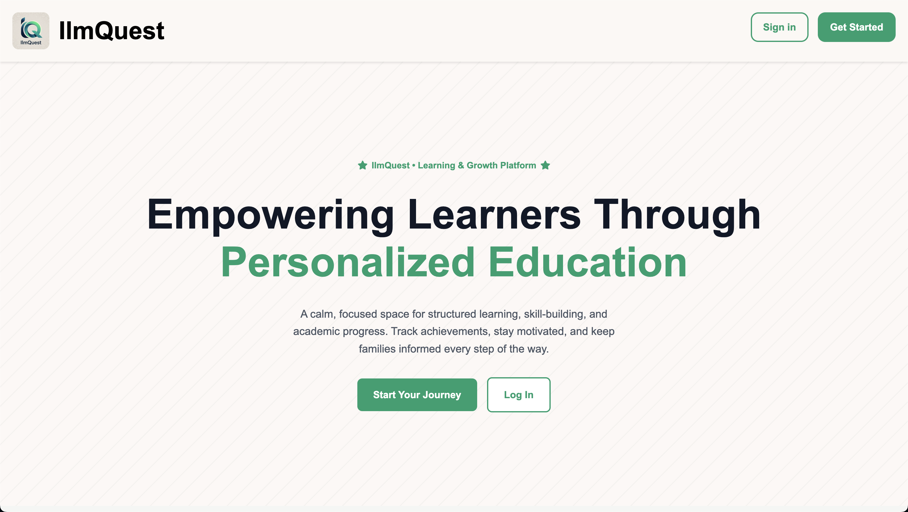

# IlmQuest

A full-stack learning platform built for Islamic schools and madrasas. IlmQuest brings together class management, gamified missions, grades, attendance, and parent communication in one focused workspace, designed to help teachers run their classroom and keep families in the loop.

**Live demo:** _coming soon_



## What it does

IlmQuest gives every role its own portal:

* **Students** complete gamified missions that earn XP and ranks, track grades, and review reflections from their teachers.
* **Teachers** plan missions, take attendance, post grades, and share updates with parents.
* **Parents** stay informed with progress snapshots and classroom communications.
* **Admins** manage schools, classes, users, and platform-wide content.

The goal is to make learning feel like progress, not paperwork.

## Tech stack

* **Backend:** Node.js, Express, MongoDB with Mongoose
* **Frontend:** EJS templates with custom CSS
* **Auth:** Passport.js with local strategy and bcrypt-hashed sessions
* **Media:** Cloudinary uploads via Multer
* **Sessions:** connect-mongo
* **Hosting:** Deployed on Render

## Highlights

* Role-based access control across four portals from a single codebase
* Gamified mission system with ranks, XP, and due dates to drive engagement
* Attendance and grade tracking flows built for everyday classroom use
* Cloudinary-backed media so teachers can attach images to posts and missions
* Seed scripts that load realistic demo data, including a curated set of hadith

## Run it locally

```bash
npm install
cp config/.env.example config/.env   # or create config/.env manually
npm start
```

`config/.env` needs:

```
PORT=2121
DB_STRING=your-mongodb-uri
CLOUD_NAME=your-cloudinary-cloud-name
API_KEY=your-cloudinary-api-key
API_SECRET=your-cloudinary-api-secret
```

Then visit `http://localhost:2121`.

## Project layout

```
backend/
  server.js          Express entry point
  controllers/       Route handlers (auth, home, posts, missions)
  models/            Mongoose schemas
  routes/            Express routes
  middleware/        Auth, multer, cloudinary
frontend/
  views/             EJS templates (admin, teacher, student, parent)
  public/            Static CSS and image assets
seed.js              Sample data loader
seedHadith.js        Hadith content loader
seedInfo.js          Misc demo content
```

## Scripts

* `npm start` runs the server with nodemon for live reload

## License

MIT
